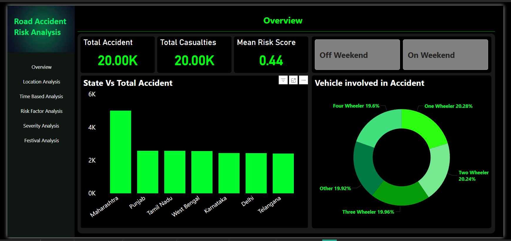

# 📊 Road Accident Risk Analysis

## 📌 Project Overview
This project analyzes road accident data to identify high-risk locations, understand accident patterns, and evaluate key factors influencing accident severity. The goal is to support data-driven decision-making for improving road safety and traffic management.

## 🎯 Business Objectives
* Identify accident-prone areas (hotspots)
* Analyze impact of time, weather, and traffic conditions
* Evaluate accident severity and contributing factors
* Compare risk across states and cities
* Understand patterns during peak hours, weekends, and festivals

## 📂 Dataset Information
* **Dataset Name:** Road Accident Dataset  
* **Total Columns:** 24  
* **Total Rows:** 20000  

### Key Features:
* Location: State, City, Latitude, Longitude  
* Time: Date, Hour, Day of Week, Weekend, Peak Hour  
* Environment: Weather, Visibility, Temperature  
* Road Conditions: Road Type, Traffic Density, Lanes  
* Accident Details: Cause, Severity, Vehicles Involved, Casualties  
* Special Factor: Festival  
* Calculated Field: Risk Score  

## 🧹 Data Preprocessing
* Handled missing values and cleaned inconsistencies  
* Standardized column names for better readability  
* Verified data consistency across features  
* Prepared dataset for SQL and dashboard analysis  

## 📊 Exploratory Data Analysis (EDA)
* Performed analysis on accident distribution across locations  
* Studied time-based patterns (hour, day, weekend trends)  
* Analyzed environmental impact (weather, visibility)  
* Evaluated traffic and road conditions impact  
* Identified patterns in accident causes and severity  

## 🔍 Key Insights
* Peak hours and weekends show higher accident frequency  
* Poor weather conditions significantly increase accident risk  
* Urban areas have higher accident concentration  
* Multi-vehicle accidents lead to higher severity  
* Certain causes contribute more to fatal accidents  

## 📈 Tools & Technologies Used
* SQL (PostgreSQL)  
* Power BI (Data Visualization)  
* Python (Pandas, NumPy)  
* Excel / CSV  

## 📊 Dashboard Features
* KPI Cards (Total Accidents, Average Risk, Fatal Cases)  
* Accident hotspot visualization using maps  
* State and city-level risk comparison  
* Time-based trend analysis  
* Cause and severity analysis  
* Festival vs normal day comparison  
    ## 📸 Dashboard Preview

### Overview

  

### Detailed Analysis

  
  

  
  

### 📌 Conclusion
The analysis highlights critical accident patterns and risk factors, enabling better decision-making for traffic control, infrastructure planning, and safety improvements.

## 🚀 Future Enhancements
* Build predictive models for accident severity  
* Implement real-time accident monitoring dashboards  
* Integrate external data sources like weather APIs  
* Develop risk scoring models using machine learning  

## 👤 Author
Ganesh Patil  
(Data Analyst)